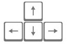

Frogger (Clone):
Classic arcade game clone project for Udacity Front-End Web Developer Nanodegree

This is the source code for my take on the classic arcade game, Frogger (and you can play the game [here](http://bahalps.github.io/frontend-nanodegree-arcade-game/)).  In the game you'll control this guy.  

Use the  **arrow keys**   to select your character 

